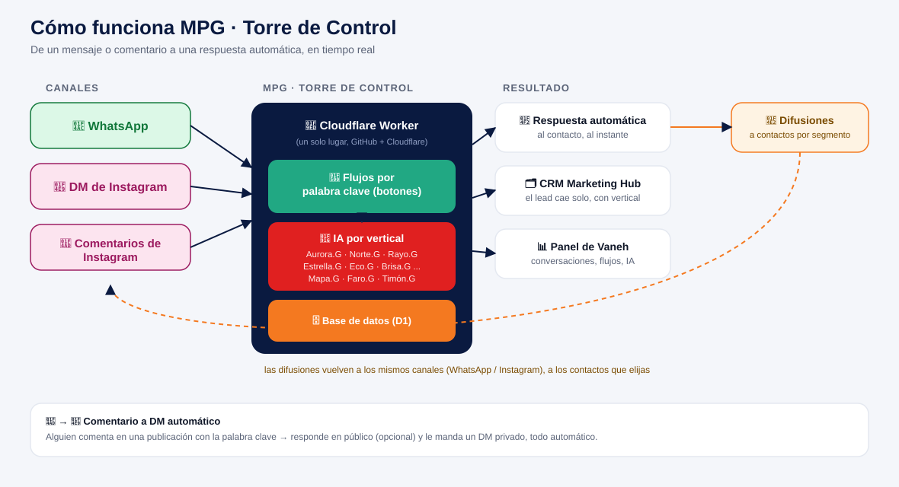

# MPG · Torre de Control — el "ManyChat" propio de COSMART

Sistema propio de automatización de ventas por WhatsApp e Instagram para todas las verticales del conglomerado COSMART. Corre entero en **Cloudflare Workers** (gratis para este volumen) y se despliega solo desde **GitHub** cada vez que hacés push. No depende de ManyChat ni de ningún servicio pago por conversación además de lo que cobra Meta y Anthropic (IA), que son centavos por conversación.

Vive bajo la vertical **MPG** ("flujos de conversación que suenan a humanos", mpg.cosmart.com.ar) — por eso todos los asistentes de IA de este sistema terminan en **".G"**.

## Cómo funciona (diagrama)



```
WhatsApp / DM de Instagram / Comentarios de Instagram (Meta)
        │  webhook
        ▼
MPG · Torre de Control (Cloudflare Worker, automation/worker)
   ├─ Flujos por palabra clave (botones)
   ├─ IA por vertical (Aurora.G, Norte.G, Rayo.G, Estrella.G, Eco.G, Brisa.G, Mapa.G, Faro.G, Timón.G)
   └─ D1 (contactos, mensajes, flujos, reglas de comentarios, ajustes)
        │
        ├─→ Respuesta automática al mismo canal
        ├─→ CRM de Marketing Hub (el lead cae solo, con la vertical detectada)
        └─→ Panel de administración (vos)
```

Todo el código vive en `automation/worker/`. El despliegue es automático: cada `git push` a `main` que toque esa carpeta dispara `.github/workflows/deploy-bot.yml`, que sube los secretos y hace `wrangler deploy` a Cloudflare. No hace falta tocar la terminal después de la puesta en marcha inicial.

## Qué incluye

- **Un número de WhatsApp Business + una cuenta de Instagram** contestando automáticamente, 24/7, en DM y en comentarios.
- **Un asistente de IA distinto por vertical**, con nombre y conocimiento propios (ver tabla abajo). Vos editás lo que sabe cada uno desde la pestaña **Verticales** del panel — la IA nunca inventa un dato que no esté ahí.
- **Etiqueta de vertical por conversación**: cada contacto queda marcado con en qué vertical terminó (además del canal por el que escribió), visible como badge en **Conversaciones**.
- **Flujos de botones** (como los de ManyChat) que vos mismo creás: elegís qué palabra los activa, armás los botones y los mensajes de cada paso, a qué vertical etiquetan, y podés activarlos/desactivarlos cuando quieras.
- **Comentario → DM automático** en publicaciones de Instagram: alguien comenta con la palabra clave que elijas → responde en público (opcional) y le manda un mensaje privado, sin que hagas nada.
- **Difusiones** a un segmento de contactos (por canal y/o vertical) — con el límite real de Meta explicado abajo.
- **Integración con el CRM de Marketing Hub**: cuando un contacto queda etiquetado con una vertical, se avisa solo a `marketing-hub` (el mismo CRM que ya usan Brújula, Training, Design, ComuniCOS...), igual que cualquier otro sitio del ecosistema.
- **Panel de administración** (`/admin`) protegido por contraseña, con el logo real de COSMART.
- **Base de datos propia** (Cloudflare D1). Es tuya, no de un tercero.

## Los asistentes por vertical

Todos hablan español, usan siempre 🧲🧭 y emojis de viaje cuando suma, y nunca inventan precios.

| Vertical | Asistente | Emoji |
|---|---|---|
| COSMART (general) | **Aurora.G** | 🌅 |
| MPG (este mismo sistema) | **Norte.G** | 🧭 |
| Rumbo Voraz (Ads) | **Rayo.G** | ⚡ |
| ComuniCOS (redes) | **Eco.G** | 📣 |
| Euforia (creadoras UGC) | **Brisa.G** | 🌊 |
| COSMART Talent (artistas) | **Estrella.G** | ⭐ |
| Design (identidad visual) | **Mapa.G** | 🎨 |
| Hub (gestión para agencias) | **Faro.G** | 🗂️ |
| COSMART Training (cursos/ebooks) | **Timón.G** | 🧳 |

Colores y textos base en `automation/worker/src/knowledge/verticals.ts` — se pueden sobrescribir por vertical desde el panel sin tocar código.

---

## Puesta en marcha (una sola vez)

### 1. Cloudflare

1. Si no tenés cuenta de Cloudflare, creá una en https://dash.cloudflare.com/sign-up (tiene plan gratuito).
2. Andá a **My Profile → API Tokens → Create Token** y creá uno con permisos de **Edit Cloudflare Workers**. Guardalo, lo vas a necesitar en el paso 3.
3. Buscá tu **Account ID**: aparece en el panel principal de Cloudflare, a la derecha.
4. En tu computadora (una sola vez, para crear la base de datos):
   ```bash
   cd automation/worker
   npm install
   npx wrangler login
   npx wrangler d1 create cosmart-bot-db
   ```
   Esto te va a devolver un `database_id`. Copialo y pegalo en `automation/worker/wrangler.toml`, reemplazando `REEMPLAZAR_CON_TU_DATABASE_ID`.
5. Cargá las tablas en la base de datos remota:
   ```bash
   npm run db:init:remote
   ```
6. Commiteá y pusheá el cambio de `wrangler.toml` (con el `database_id` real) a `main`.

### 2. Meta (WhatsApp + Instagram)

Ambos productos se manejan desde la misma "App" de Meta.

1. Entrá a https://developers.facebook.com/ y creá una App de tipo **Business**.
2. Agregá el producto **WhatsApp**:
   - Te da un número de prueba gratis para empezar, o conectás tu número real de WhatsApp Business.
   - Anotá el **Phone Number ID**.
   - Generá un **token permanente**: System User en Meta Business Suite (Configuración del negocio → Usuarios → Usuarios del sistema), asignale la App y el WhatsApp, generá un token sin vencimiento con permiso `whatsapp_business_messaging`.
3. Agregá el producto **Instagram** (Instagram Messaging API):
   - Necesitás una cuenta de Instagram **profesional** conectada a una **Página de Facebook**.
   - Generá un **Page Access Token** con permisos `pages_messaging`, `instagram_manage_messages` **e `instagram_manage_comments`** (este último es el que habilita el "comentario → DM automático").
4. Guardá tu **App Secret** (Configuración de la App → Básica → Mostrar).
5. Todavía no configures el Webhook: se hace en el paso 4, una vez desplegado.

### 3. Secretos en GitHub

**Settings → Secrets and variables → Actions → New repository secret**. Nombres exactos:

| Secret en GitHub | Qué va ahí |
|---|---|
| `CLOUDFLARE_API_TOKEN` | El token del paso 1.2 |
| `CLOUDFLARE_ACCOUNT_ID` | Tu Account ID del paso 1.3 |
| `BOT_ADMIN_TOKEN` | Inventá una contraseña larga: es la que vas a usar para entrar al panel `/admin` |
| `BOT_META_VERIFY_TOKEN` | Inventá cualquier palabra; la vas a repetir en el paso 4 |
| `BOT_META_APP_SECRET` | El App Secret del paso 2.4 |
| `BOT_WHATSAPP_TOKEN` | El token permanente del paso 2.2 |
| `BOT_WHATSAPP_PHONE_NUMBER_ID` | El Phone Number ID del paso 2.2 |
| `BOT_IG_PAGE_ACCESS_TOKEN` | El Page Access Token del paso 2.3 |
| `BOT_ANTHROPIC_API_KEY` | Tu API key de Anthropic (consola.anthropic.com → API Keys) |

Con esto cargado, hacé `git push` a `main` (o re-ejecutá el workflow desde **Actions**). El bot queda publicado en:

```
https://cosmart-bot.<tu-subdominio>.workers.dev
```

> **¿Dominio propio?** Cloudflare → Workers & Pages → tu Worker → Settings → Domains & Routes, agregá algo como `mpg.cosmart.com.ar`.

### 4. Configurar el Webhook en Meta

1. En WhatsApp → Configuración e Instagram → Configuración: mismo webhook para ambos:
   - **Callback URL:** `https://<tu-worker>.workers.dev/webhook/meta`
   - **Verify Token:** el mismo valor de `BOT_META_VERIFY_TOKEN`
2. Suscribite a los campos:
   - WhatsApp: `messages`
   - Instagram: `messages`, `messaging_postbacks`, **`comments`** (para el comentario → DM automático)
3. Meta verifica la URL automáticamente al guardar.

### 5. Primeros pasos en el panel

1. Entrá a `https://<tu-worker>.workers.dev/admin` e iniciá sesión con el `BOT_ADMIN_TOKEN`.
2. En **Ajustes de IA**, tocá **"Cargar el flujo de bienvenida por defecto"**.
3. En **Verticales**, revisá y ajustá lo que sabe cada asistente (precios exactos, tono).
4. En **Flujos**, editá el menú de bienvenida o creá los que quieras — cada paso puede etiquetar una vertical.
5. En **Comentarios**, creá tus reglas de "comentario → DM" para posteos/reels puntuales.
6. Escribile "hola" al WhatsApp o Instagram conectado y probá el menú.

---

## Cómo funciona el bot en el día a día

1. Si un humano ya tomó la conversación (respuesta manual desde el panel), el bot no contesta hasta que se reactive.
2. Si el mensaje activa un flujo o el contacto está en medio de uno, se muestran los botones de ese paso — y si el paso tiene vertical asignada, la conversación queda etiquetada (y se avisa una vez al CRM de Marketing Hub).
3. Si no aplica ningún flujo y la IA está activada, contesta el asistente de la vertical que corresponda (o Aurora.G/COSMART si todavía no se etiquetó ninguna).
4. Si la IA está apagada y no hay flujo, se manda el mensaje por defecto.
5. "Hablar con una persona" apaga el bot en esa conversación.
6. Un comentario en Instagram que matchea una regla activa dispara la respuesta pública (opcional) + el DM privado, y arranca una conversación normal en **Conversaciones**.

## Difusiones — qué se puede y qué no

⚠️ **Meta no permite hoy mandar mensajes desde la API de negocio a grupos ni canales de WhatsApp** — es una restricción real de la plataforma, no nuestra. Lo que sí se puede (y lo que hace la pestaña **Difusiones**) es mandar un mensaje a una lista de contactos individuales filtrada por canal y/o vertical, uno por uno. Para WhatsApp, además, a los contactos con los que no hablás hace más de 24hs Meta exige una **plantilla aprobada** — un texto libre les va a fallar. Si más adelante hace falta, se puede sumar soporte de plantillas.

## Costos esperados

- **Cloudflare Workers + D1:** gratis en el plan free hasta 100.000 requests/día.
- **WhatsApp Cloud API:** conversaciones iniciadas por el cliente gratis hasta un volumen generoso; después centavos de dólar por conversación.
- **Instagram Messaging:** gratis.
- **Anthropic (Claude):** con Haiku 4.5 (el modelo por defecto), fracciones de centavo por respuesta.

## Limitaciones actuales

- Solo procesa **texto y botones**; no transcribe audios ni analiza imágenes todavía.
- Difusiones no soportan plantillas de WhatsApp todavía (ver arriba).
- Un solo panel de administración (una contraseña compartida).
- El lead de un contacto de Instagram solo llega al CRM de Marketing Hub si en algún momento deja un teléfono o mail en la charla (el CRM exige uno de los dos) — Instagram no nos da esos datos solo.

## Desarrollo local

```bash
cd automation/worker
cp .dev.vars.example .dev.vars   # completá los valores de prueba
npm install
npm run db:init:local
npm run dev
```
